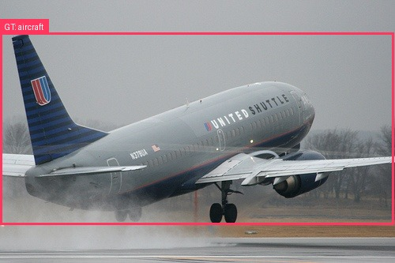
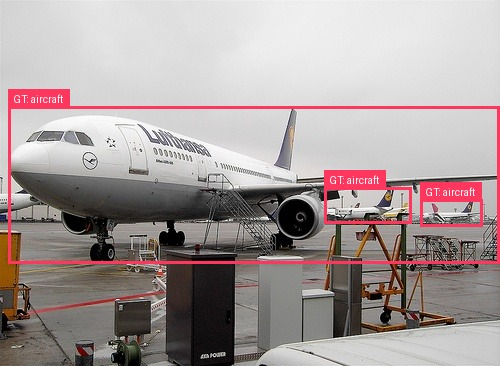
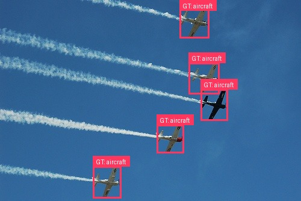
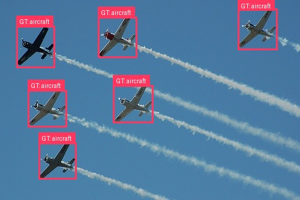
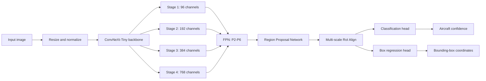

# ConvNeXt Aircraft Detector

[](https://www.python.org/)
[](https://pytorch.org/)
[](#model-architecture)
[](#evaluation-results)

Aircraft object detection with an ImageNet-pretrained **ConvNeXt-Tiny**
backbone, a **Feature Pyramid Network (FPN)**, and **Faster R-CNN**. The model
is trained as a single-class detector on the `aeroplane` category from Pascal
VOC 2007.

## Evaluation results

| Metric | Result |
|---|---:|
| **mAP@50** | **87%** |
| **Precision** | **82%** |

The reported results use an Intersection over Union threshold of `0.50`.
`mAP@50 = 87%` indicates strong localization and classification performance on
the evaluation set, while `Precision = 82%` means that most predicted aircraft
boxes are correct detections rather than false positives.

> The repository does not report a recall value because a verified recall
> measurement was not available when this report was written.

## Project overview

The goal is to locate every aircraft in an image and return a bounding box with
a confidence score. This is an object detection task, not image
classification: an image may contain zero, one, or multiple aircraft.

The project provides:

- Pascal VOC dataset preparation and aircraft-only label conversion
- Detection-safe horizontal flip augmentation
- ConvNeXt-Tiny multi-scale feature extraction
- Faster R-CNN training and evaluation
- Automatic best/latest checkpoint management
- Single-image and directory inference
- Bounding-box visualization
- Unit and end-to-end smoke tests

## Dataset

### Pascal VOC 2007

[Pascal VOC](https://www.robots.ox.ac.uk/~vgg/projects/pascal/VOC/voc2007/) is a standard object
detection dataset containing natural images, object categories, and bounding
box annotations. This project uses the 2007 release.

| Split | Images | Usage |
|---|---:|---|
| `trainval` | 5,011 | Model training |
| `test` | 4,952 | Reported evaluation |

Pascal VOC contains 20 object classes. The dataset adapter keeps only the
`aeroplane` annotations and maps them to the single foreground label
`aircraft`; label `0` remains reserved for background.

### Preprocessing

- Images are converted to RGB tensors in the `[0, 1]` range.
- Bounding boxes use the `xyxy` representation.
- Invalid boxes and objects marked as `difficult` are excluded.
- Random horizontal flipping is applied during training and updates the boxes
  consistently.
- Aircraft-free images remain in the training set to provide background
  examples and reduce false positives.

### Ground-truth bounding box examples

The pink boxes below come from the original **Pascal VOC 2007 trainval XML
labels**. They show the annotated aircraft in the dataset; they are not model
predictions or examples used to calculate the reported mAP.

| One aircraft (`000117`) | Three aircraft (`000033`) |
|:---:|:---:|
|  |  |

| Five aircraft (`000936`) | Six aircraft (`007152`) |
|:---:|:---:|
|  |  |

To reproduce these images from a local copy of VOC 2007:

```bash
python scripts/render_voc_labels.py 000117 000033 000936 007152
```

## Model architecture



### 1. ConvNeXt-Tiny backbone

[ConvNeXt](https://arxiv.org/abs/2201.03545) is a modern convolutional network
that incorporates design ideas associated with hierarchical vision models
while retaining a pure ConvNet structure. The ImageNet-pretrained Tiny variant
is used for transfer learning. Four stages output feature maps with 96, 192,
384, and 768 channels.

By default, the final two ConvNeXt stages are fine-tuned. Earlier stages remain
frozen to preserve general ImageNet features and reduce training cost.

### 2. Feature Pyramid Network

The FPN converts the four backbone outputs into 256-channel feature maps and
adds a pooled fifth level. These multi-scale features allow the detector to
handle both relatively small and large aircraft.

### 3. Region Proposal Network

The RPN searches the feature pyramid for regions that may contain an aircraft.
Anchors with sizes from 16 to 256 pixels and aspect ratios of `0.5`, `1.0`, and
`2.0` cover objects with different scales and shapes.

### 4. Faster R-CNN heads

Multi-scale RoI Align extracts a fixed-size representation for each proposal.
The classification head distinguishes aircraft from background, while the box
regression head refines the aircraft coordinates. The complete model is
trained end-to-end using classification, objectness, RPN regression, and final
box regression losses.

## Default training configuration

| Setting | Value |
|---|---|
| Backbone initialization | ImageNet pretrained |
| Trainable ConvNeXt stages | Final 2 stages |
| Optimizer | AdamW |
| Learning rate | `3e-4` |
| Weight decay | `1e-4` |
| Scheduler | Cosine annealing |
| Epochs | 12 |
| Batch size | 2 |
| Input size | 512-1024 px |
| Mixed precision | Enabled on CUDA |
| Checkpoint selection | Best evaluation mAP@50 |

## Installation

Python 3.9 or newer is required. A CUDA GPU is recommended for training, but
CPU and Apple Silicon MPS are also supported.

```bash
git clone https://github.com/nguyenhuynh110907-ops/convnext-aircraft-detector.git
cd convnext-aircraft-detector

python3 -m venv .venv
source .venv/bin/activate
python -m pip install --upgrade pip
python -m pip install -e ".[dev]"
```

## Training

Download Pascal VOC 2007 and start training:

```bash
python train.py --download --epochs 12 --batch-size 2
```

The run produces:

```text
runs/convnext_tiny/best.pt       best mAP@50 checkpoint
runs/convnext_tiny/last.pt       latest checkpoint
runs/convnext_tiny/history.jsonl per-epoch metrics
```

Resume an interrupted experiment:

```bash
python train.py --resume runs/convnext_tiny/last.pt --epochs 20
```

For hardware with limited memory:

```bash
python train.py --download --batch-size 1 --min-size 384 --max-size 768
```

## Inference

Run detection on one image:

```bash
python predict.py \
  --checkpoint runs/convnext_tiny/best.pt \
  --input path/to/aircraft.jpg \
  --threshold 0.5
```

Process every supported image in a directory:

```bash
python predict.py \
  --checkpoint runs/convnext_tiny/best.pt \
  --input path/to/images \
  --output-dir outputs
```

Each output image contains red aircraft boxes, confidence labels, and the
original filename with a `_detected.jpg` suffix.

## Repository structure

```text
.
├── train.py                         # training and validation entry point
├── predict.py                       # inference and visualization
├── scripts/render_voc_labels.py     # draw ground-truth VOC boxes
├── assets/ground_truth/             # four annotated dataset samples
├── src/aircraft_detector/
│   ├── data.py                      # Pascal VOC adapter and augmentation
│   ├── model.py                     # ConvNeXt-FPN Faster R-CNN
│   ├── engine.py                    # training and mAP evaluation loops
│   └── checkpoint.py                # atomic checkpoint utilities
└── tests/
    ├── test_data.py                 # annotation and box-transform tests
    └── test_model.py                # feature-pyramid architecture test
```

## Verification

```bash
pytest -q
```

The current implementation passes all three unit tests and an additional
end-to-end synthetic detector smoke test.

## Limitations

- Pascal VOC contains a limited number of aircraft compared with modern
  domain-specific datasets.
- Its images mostly show aircraft from natural viewpoints. Performance does
  not directly transfer to tiny aircraft in satellite imagery.
- Satellite detection may require high-resolution tiling, smaller anchors,
  rotated bounding boxes, and datasets such as DOTA or xView.
- The reported precision depends on the selected confidence threshold.
- For strict benchmark reporting, a separate validation split should be used
  for checkpoint selection and the test split should be evaluated only once.

## Future work

- Evaluate recall and F1 score at a documented confidence threshold.
- Fine-tune on an aerial or satellite aircraft dataset.
- Add rotated bounding-box support for top-down imagery.
- Compare ConvNeXt-Tiny against ResNet-50 and Swin Transformer backbones.
- Export the trained detector for deployment through TorchScript or ONNX.
